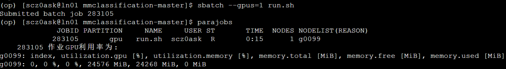
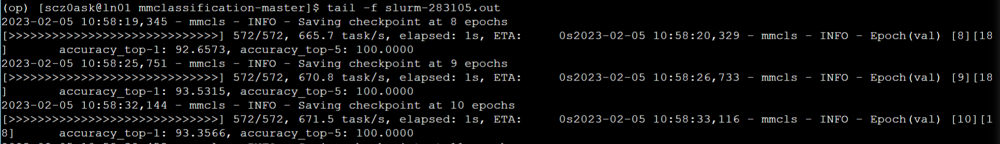

# Homework1
作业说明：https://github.com/open-mmlab/OpenMMLabCamp/blob/main/AI%20%E5%AE%9E%E6%88%98%E8%90%A5%E5%9F%BA%E7%A1%80%E7%8F%AD/%E4%BD%9C%E4%B8%9A%E4%B8%80%20mmclassification
- 使用北京超级云计算（RTX3090）
- 数据集地址 https://pan.baidu.com/s/1RJmAoxCD_aNPyTRX6w97xQ 提取码: 9x5u


## 环境配置

进入客户端，点击SSH，选择地区节点，进入terminal，`run`文件夹下为分配的存储空间
使用如下命令查看已经安装的环境
```bash
module avail
```
输入命令加载anaconda
```bash
module load anacondaxxxxxx
```
使用pip安装torch（🅰️注意，GPU为3090，cuda版本最低就是11.0）
```bash
pip install torch==1.10.0+cu111 torchvision==0.11.0+cu111 torchaudio==0.10.0 -f https://download.pytorch.org/whl/torch_stable.html
```
之后安装mmcv，在官网查文档，根据torch和cuda版本查询
```bash
pip install mmcv-full==1.7.0 -f https://download.openmmlab.com/mmcv/dist/cu111/torch1.10/index.html
```
完成后下载，可以使用快穿或者git下载mmclassification，通过在根目录下执行
```bash
pip install -e .
```
完成安装
除此之外还下载openmim和mmengine来使用mim
```bash
pip install openmim, mmengine
```

## 训练

进入mmclassification根目录，新建一个data文件夹，上传制作好的数据集
之后在configs文件夹里新建一个resnet18文件夹
在里面使用mim下载对应配置文件和权重
```bash
mim download mmcls --config [你喜欢的配置&权重，没有.py] --dest .
```
之后修改其中的.py文件，修改训练类别、学习率等内容，内容如下所示：
```python
_base_ = ['../_base_/models/resnet18.py','../_base_/datasets/imagenet_bs32.py','../_base_/default_runtime.py']
model = dict(
        head=dict(
        num_classes=5,
        topk=(1, )))
data = dict(
    samples_per_gpu=32,
    workers_per_gpu=2,
    train=dict(
        data_prefix='data/flower_dataset/train',
	ann_file = 'data/flower_dataset/train.txt',
	classes = 'data/flower_dataset/classes.txt'
        ),
    val=dict(
        data_prefix='data/flower_dataset/val',
        ann_file='data/flower_dataset/val.txt',
	classes = 'data/flower_dataset/classes.txt'
        )
)
optimizer = dict(type='SGD', lr=0.01, momentum=0.9, weight_decay=0.0001)
optimizer_config = dict(grad_clip=None)
lr_config = dict(policy='step', step=[1])
runner = dict(type='EpochBasedRunner', max_epochs=100)
load_from = '~/run/mmclassification-master/configs/resnet18/resnet18_8xb32_in1k_20210831-fbbb1da6.pth'
```
完成后制作作业脚本，`run.sh`
```bash
#!/bin/bash
module load anaconda/2021.05
module load cuda/11.1
module load gcc/7.3

source activate op

export PYTHONUNBUFFERED=1

python tools/train.py configs/resnet18/resnet18_8xb32_in1k.py --work-dir configs/work
```
通过`sbatch`在mmclassification根目录提交作业，使用`parajobs`查看状态

此时会生成一个`.out`文件，通过
```
tail -f xxx.out
```
来跟踪输出
